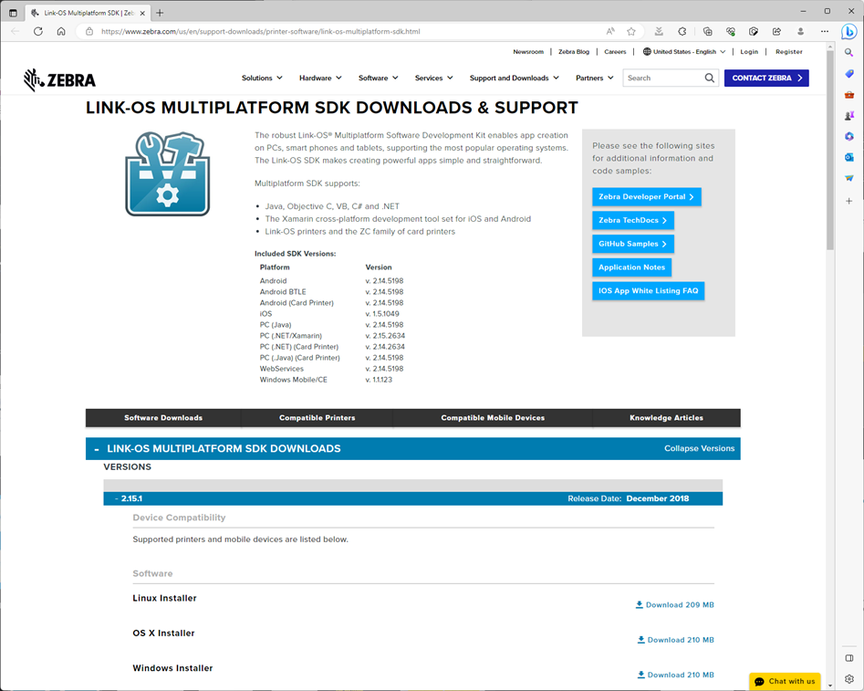

## Zebra-Printer_SDK_How to Print with 1 Row Coding 

# ゼブラプリンタ - 1行コードで印刷する方法

Link-OS SDKにはネットワークとUSB接続されているプリンタ向けに簡易に印刷処理の組み込みができるように「1行コードメソッド」が含まれている。本スレッドではそのメソッドの利用方法について概要を記載する。

 
 

# 環境構築 (Zebra プリンタ)

1. プリンタをネットワークに接続する。  
    Zebra Setup Utilities で設定する。

1. PCをプリンタと疎通できるネットワークに接続する。

1. PCがプリンタと疎通できることを確認する。

    1. 確認方法１ - Ping

            C:\test\lib>ping 192.168.4.54

            192.168.4.54 に ping を送信しています 32 バイトのデータ:
            192.168.4.54 からの応答: バイト数 =32 時間 =7ms TTL=255
            192.168.4.54 からの応答: バイト数 =32 時間 =5ms TTL=255
            192.168.4.54 からの応答: バイト数 =32 時間 =4ms TTL=255
            192.168.4.54 からの応答: バイト数 =32 時間 =3ms TTL=255

            192.168.4.54 の ping 統計:
                パケット数: 送信 = 4、受信 = 4、損失 = 0 (0% の損失)、
            ラウンド トリップの概算時間 (ミリ秒):
                最小 = 3ms、最大 = 7ms、平均 = 4ms

         

    1. 確認方法2 - http (ブラウザの検索バーにプリンタのIPアドレスを入力)

        

  

# 環境構築（PC）

本メソッドはマルチOS（Unix/Linux/Windows/Mac）で利用が可能だが、本スレッドではWindows 10 のユーザをベースに解説をしていく。その他OSの利用者はゼブラ社のSDK に関するドキュメントなどを参照すること。

1. JDK のDLとインストール

    JDK がインストールされていない場合、下記リンクを参考にインストールをすること。

    参考リンク：  
    https://codeforfun.jp/how-to-install-java-jdk-on-windows-and-mac/

     

    参考：PCが64bit/32bitのいずれかわからない場合は下記コマンドで確認すること。  
     ※ 下記は64bit Windowsの場合

        C:\Users\zebra> wmic os get osarchitecture
        OSArchitecture
        64-bit ★

     

    参考： JDKがインストール済みか確認する方法

        インストールされていない場合

        C:\Users\moget>javac -version
        'javac' は、内部コマンドまたは外部コマンド、
        操作可能なプログラムまたはバッチ ファイルとして認識されていません。 ★

     

    例、インストール済みの場合の表示

        C:\> java -version
        java version "20.0.1" 2023-04-18
        Java(TM) SE Runtime Environment (build 20.0.1+9-29)
        Java HotSpot(TM) 64-Bit Server VM (build 20.0.1+9-29, mixed mode, sharing)
        
        C:\> javac -version
        javac 20.0.1

     

1. Link-OS Multiplatform SDK のDLとインストール

    DLサイトから"Windows Installer"をダウンロードし、インストールすること。

    ダウンロードサイト：  
    https://www.zebra.com/us/en/support-downloads/printer-software/link-os-multiplatform-sdk.html 

    

     

   ### ※ SDKのインストールが失敗する場合は下記リンクの手順を参考にインストールを進めること。

    #### Multiplatform SDK のインストール時にUnExpected Errorが発生する

    https://github.com/shimauma-giken/Zebra-Printer_Multiplatform-SDK-Installation-Fails-on-Windows-10-and-11-with-Unexpected-Error

     
     

1. インストールされたSDKのライブラリ（"lib"フォルダ）を任意の場所にコピーする。  

    ### ※ 本スレッドでは"C:\test"にコピーした前提で解説を進める。

     

    ▽ ライブラリフォルダは下記に存在する。
    
        C:\Program Files\Zebra Technologies\link_os_sdk\PC\v[バージョン名]

    

     

    ▽ "C:\test"下にコピーしたところ

    

     

1. 本スレッドから下記ファイルをダウンロードし、コピーした"lib"ディレクトリ下にコピーする。

    - start-dos.bat
    - start-powershell.bat
    - sample-powershell-batch01.ps1
    - csv-data.csv
    - csv-temp.zpl

     

    

     

1. start-dos.bat をダブルクリックする。コマンドプロンプトが起動する。

1. 下記コマンドを実行し、同様の画面表示となることを確認する。

    コマンド：java -jar ZSDK_API.jar

        C:\test\lib>java -jar ZSDK_API.jar
        ZebraLink Multiplatform SDK - Version 2.14.5198
        usage: java -jar ZSDK_API.jar <commmand> [<args>]

        Commands include:

        backup      - Creates a backup of the printer and stores it to the local file
        certificate - Sends a certificate file directly to a Zebra printer.
        clock       - Set the Real-Time Clock.
        config      - Prints the configuration label.
        convertfont - Converts a TTF/TTE font for storage on a Zebra Printer.
        default     - Restore printer defaults.
        delete      - Deletes a file on the printer's file system.
        discover    - Discover printers
        get         - Retrieves files from the printer.
        graphic     - Converts a graphic for storage on a printer
        help        - Get information about other commands
        loadbackup  - Loads backup onto printer. Will delete existing printer files.
        loadprofile - Loads profile onto printer.
        ls          - Lists the files on the remote printer
        mirror      - Uploads a zprofile to a mirror server
        print       - Print XML or CSV files
        profile     - Creates a profile based on the printer
        reset       - Resets a printer
        send        - Sends data to the raw port on the printer
        sendJSON    - Sends JSON data to the printer
        status      - Retrieve the status of the printer
        store       - Stores a local file onto a printer.
        template    - Fill in a zpl/cpcl template file with xml or csv
        update      - Updates the firmware on the printer
        weblink     - Configures the weblink address

        Use 'java -jar ZSDK_API.jar <command> --help' to see more information on a specific command

        Use 'java -jar ZSDK_API.jar help <command>' to see examples and information on a specific command

        C:\test\lib>

        ▲ エラーが発生したら、本スレッドの手順を最初からやり直すこと。

1. 準備完了

     
     

# コマンドの実行方法

1. 上記手順でコピーしたstart-dos.batをダブルクリックする。
1. コマンドを入力する。

     
     

# 1行コードの構文

1. 基本構文

        java -jar ZSDK_API.jar <commmand> [<args>]

     

1. 例、ステータス確認

        java -jar ZSDK_API.jar status 192.168.4.54

        READY TO PRINT 

     

1. 例、印刷
    
        java -jar ZSDK_API.jar send 192.168.4.54 “^XA^A0N,50,50～略～^XZ”

     
     

## 構文がわからなくなった場合はHelp機能を活用しよう

ZSDK_API.jarのドキュメントはHelp のみ。Helpの有効活用が上達の鍵。

1. 構文の概要

        java -jar ZSDK_API.jar help

     

1. ヘルプ - コマンドの引数

        java -jar ZSDK_API.jar <command> --help

     

        C:\test\lib>java -jar ZSDK_API.jar status --help
        usage: java -jar ZSDK_API.jar status <printer> [<options>]

        Retrieve the status of the printer

        Options include:
        -p/--printer    - Printer Status
        -r/--portstatus - Port Status
        -o/--odometer   - Odometer status
        --tcp           - Force connection to be made via TCP.
        -d/--driver     - Force connection to be made via ZDesigner Driver.
        -h/--help       - Print the help message
        -v/--verbose    - Verbose output

        use --help option to display this message

     

1. ヘルプ - コマンドの構文例

        java -jar ZSDK_API.jar help <command>

     

        C:\test\lib>java -jar ZSDK_API.jar help status
        Help for status command

        Description:
        Retrieve the status of the printer

        Option descriptions:
        -p/--printer    - Printer Status
        -r/--portstatus - Port Status
        -o/--odometer   - Odometer status
        --tcp           - Force connection to be made via TCP.
        -d/--driver     - Force connection to be made via ZDesigner Driver.
        -h/--help       - Print the help message
        -v/--verbose    - Verbose output

        Example commands:
        Get the status for a printer at 10.3.4.5
                java -jar ZSDK_API.jar status 10.3.4.5
        Get the port status for a printer at XXB1234
                java -jar ZSDK_API.jar status XXB1234 --portstatus
        Get the status for a printer via ZDesigner Driver
                java -jar ZSDK_API.jar status "ZDesigner QLn320" --driver
        Get the status for a printer via Driverless USB
                java -jar ZSDK_API.jar status "USB_DIRECT:\\?\usb#vid_0a5f&pid_00f2#imz220#..."

     
     

# 基本操作1 - プリンタのステータス確認

- status コマンドで様々なステータス確認ができる。最も利用されるのが、-p と -o。

        usage: java -jar ZSDK_API.jar status <printer> [<options>]

     

1. プリンタの状態を取得。

        C:\test\lib>java -jar ZSDK_API.jar status 192.168.4.54
        Ready To Print

     

        C:\test\lib>java -jar ZSDK_API.jar status 192.168.4.54
        HEAD OPEN

     

        C:\test\lib>java -jar ZSDK_API.jar status 192.168.4.54
        PAPER OUT

     
     

    ## 取得できるステータス一覧

    | Status    | Description |
    |-|-|
    Head Cold| 		The head is cold.
    Head Open| 		The head is open.
    Head Too Hot| 	The head is too hot.
    Paper Out| 		The paper is out.
    Partial Format In Progress| 	There is a partial format in progress.
    Paused| 		The printer is paused.
    Ready To Print| 	The printer reports back that it is ready to print
    Receive Buffer Full| 	The receive buffer is full.
    Ribbon Out| 		The ribbon is out.

     
     

1. メンテナンス情報の取得（走行距離、印刷枚数など）

        C:\test\lib>java -jar ZSDK_API.jar status 192.168.4.54 -o
        Total Print Length: 8780
        Head Clean Count: 8780
        Label Dot Length: 415
        Head New: 8780
        Latch Open Count: 224
        User Resettable Counter: 1272
        User Resettable Counter 1: 8780
        User Resettable Counter 2: 8780
        User Label Resettable Counter: 127
        User Label Resettable Counter 1: 951
        User Label Resettable Counter 2: 951

     
     

# 基本操作2 - 印刷してみよう

send コマンドでZPL印刷ができる。ZPLはファイルでも、直書きでも対応が可能。

1. ZPLを送信

        C:\test\lib>java -jar ZSDK_API.jar send 192.168.4.54 "^XA^A0N,50,50^F0,30,30^FDHello Link-OS SDK!!^FS^XZ"
            ★ 一枚、印刷が出力される。

        C:\test\lib>

     

1. ZPLファイルを送信

        C:\test\lib>java -jar ZSDK_API.jar send 192.168.4.54 zpl-hello.zpl -e ASCII
            ★ 一枚、印刷が出力される。

        C:\test\lib>

     

1. ZPLコマンドを送信

        C:\test\lib>java -jar ZSDK_API.jar send 192.168.4.54 ~WC
            ★ 設定ラベルが出力される

        C:\test\lib>

     

1. !!! NG !!! 返り値が発生するコマンドにsendは利用できない

        C:\test\lib>java -jar ZSDK_API.jar send 192.168.4.54 ~HS
            ★返り値なし。

        C:\test\lib>java -jar ZSDK_API.jar send 192.168.4.54 "! U1 getvar \"media\""
            ★返り値なし。

     
     

# 基本操作3 - USB接続プリンタからの出力

USB接続されたプリンタからも出力が可能。この場合、--driver オプションを付与すること。

 

1. プリンタドライバのプロパティ画面でドライバ名を取得する。下記画面の場合は「ZDesigner ZQ620 (ZPL)」

    

     

1. start-dos.batを実行する。

     

1. コマンド例、

    送信先プリンタ名は上記で取得したドライバ名を指定すること。

        C:\test\lib>java -jar ZSDK_API.jar send "ZDesigner ZQ620 (ZPL)" ~JC --driver
        ★ キャリブレーションを実施

        C:\test\lib>java -jar ZSDK_API.jar send "ZDesigner ZQ620 (ZPL)" "^XA^A0N,50,50^F0,30,30^FDHello Link-OS SDK!!^FS^XZ" --driver
        ★ ZPLで印刷

        C:\test\lib>java -jar ZSDK_API.jar send "ZDesigner ZQ620 (ZPL)" zpl-hello.zpl --driver
        ★ ZPLファイルで印刷

     
     

# 応用1 - テンプレートとcsvを利用した印刷

実際の現場ではデータベースやCSVなどから取得した可変データをテンプレートに代入して印刷することが多い。ZSDK_APIを利用した場合のサンプルを記載する。XMLを利用した印刷も可能。XMLの活用に興味がある方はHelpを参照。

 

1. テンプレートファイルをZebra Designer 3 Developer等を用いて作成する。

    本スレッドでは例として、下記のテンプレートを使用する。

    - テンプレートファイル / csv-temp.zpl

            ^XA^DFE:csv-temp.zpl^FS
            ^A0N,50,50^CI28^FO0,100^FN1"Customer Name"^FS
            ^A0N,50,50^FO0,150^FN2"Component Name"^FS
            ^A0N,50,50^FO0,200^FN3"Vendor Name"^FS
            ^A0N,50,50^FO0,250^FN4"Vendor ID"^FS
            ^A0N,50,50^FO0,300^FN5"Invoice Number"^FS
            ^XZ

        ▲　FN1 ～ FN5（合計5つ）の変数データがある。 

     

1. テンプレートファイルに合わせて、CSVデータを作成する。

    本スレッドでは例として、下記のCSVデータを使用する。

    - CSVデータ / csv-data.csv

            Zebra Techonologies Japan,Component 01,Shimauma,001-999,INV-001
            Zebra Techonologies Japan,Component 02,Shimauma,001-999,INV-002
            Zebra Techonologies Japan,Component 03,Shimauma,001-999,INV-003
        
        ▲ テンプレートに合わせて5カラムのデータを作成

     

1. 印刷コマンド例1、 CSVファイルを用いた印刷

        > java -jar ZSDK_API.jar print 192.168.4.54 .\csv-data.csv --template .\csv-temp.zpl --csv

        ★ csv データが代入されたラベルが合計3枚印刷される。

     

1. 印刷コマンド例2、 CSVデータを用いた印刷

        >　java -jar ZSDK_API.jar print 192.168.4.54 "Zebra Techonologies Japan,Component 01,Shimauma,001-999,INV-001" --template .\csv-temp.zpl
        --csv

        Could not find file, interpreting second argument as data.
        ★ パラメータとして記載したCSVデータを印刷。エラーではない。

     
     

# 応用2 - 簡単なバッチ処理を作成し、実行してみよう

1. テキストエディタ（メモ帳など）を開き、実行したいコマンドを記載する。

     

1. ファイル名、sample.batとして、ZSDK_API.jar と同じフォルダに保存する。

    ▽ 例、ファイル名：sample.bat

        java -jar ZSDK_API.jar print 192.168.4.54 .\csv-data.csv --template .\csv-temp.zpl --csv

     

1. sample.batを実行する。

     
     
    

# 応用3 - 高度なバッチ処理を実行してみよう

一般的によく利用される「プリンタが待機状態なら印刷する」処理を体験するプロセス。20行足らずでちょっとしたバッチ処理が作成できる。

下記にサンプルバッチの実行方法を記載しているが、Powershell 上級者はps1拡張子で保存して実行してもOK。

 

1. start-powershell.bat を実行する。コマンドプロンプト（Powershell）が起動する。

     

1. 下記スクリプトの"IPアドレス($ipAddr値)"を接続先のプリンタのものに書き換える。

    ▽ 参考 : sample-powershell-batch01.ps1

        # ############################################################################
        # プリンタのステータスが"Ready to Print"だったら印刷するバッチ処理
        # ############################################################################
        # ZSDK_API.jarと同じ階層で実行すること!!
        # $ippAddr を送信先プリンタのIPに変更すること!!

        $ipAddr = "192.168.4.54" 
        $statusReady = "Ready To Print"

        $now = date

        while ($var -le 4){
            $now = date
            $nowStr = $now.ToString("yyyy-MM-dd hh:mm:ss")

            $statusLatest = java -jar ZSDK_API.jar status  $ipAddr

            if ($statusLatest -eq $statusReady) {
                Write-Output ($nowStr + " > Info: Send print job because printer status is " + $statusLatest)
                java -jar ZSDK_API.jar send $ipAddr "^XA^FO50,50^A0N,50,50^FDHello Link-OS SDK!!^FS^XZ"
                Write-Output ($nowStr + " > Info: Print JOB has been sent") 
                $var++       
            }else{
                Write-Output ($nowStr + " > Warn: Waiting to send print job because printer status is " + $statusLatest)
            }
            Start-Sleep -Seconds 0.1
        }

     

1. 書き換えたら、スクリプトをコマンドプロンプトにすべてコピーする。

1. [強制的に貼り付け] を選択する。

    

     

1. バッチ処理が開始される。"Ready to Print" 状態の時だけ印刷されることを確認する。

        PS C:\test\lib> .\sample-powershell-batch01.ps1

        2023-08-05 10:36:01 > Info: Send print job because printer status is Ready To Print
        2023-08-05 10:36:01 > Info: Print JOB has been sent
        2023-08-05 10:36:10 > Warn: Waiting to send print job because printer status is HEAD OPEN
        2023-08-05 10:36:15 > Warn: Waiting to send print job because printer status is HEAD OPEN
        2023-08-05 10:36:21 > Info: Send print job because printer status is Ready To Print
        2023-08-05 10:36:21 > Info: Print JOB has been sent

    ▲ 処理途中にエラーを発生させた場合のログ。

     

1. Powershellを閉じる。

     
     

